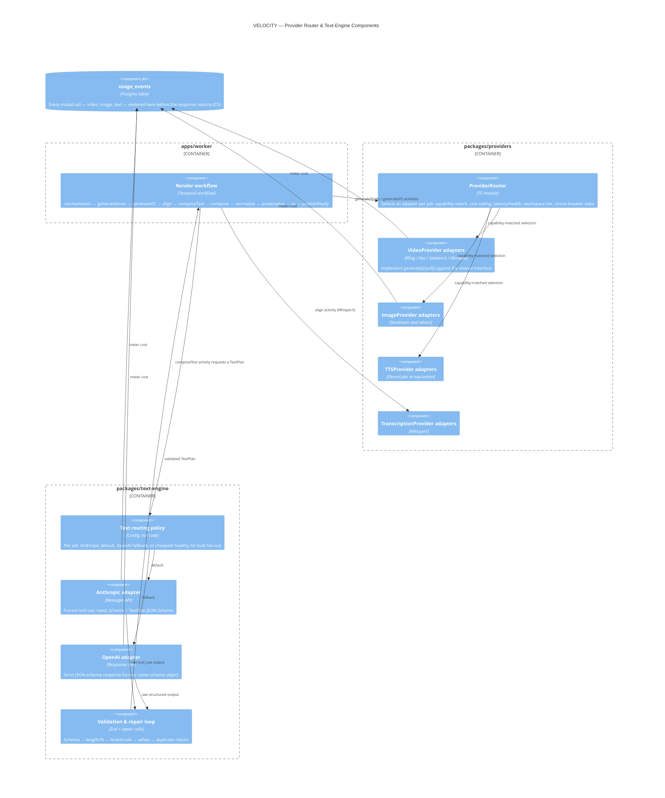

# C4 — Component Diagram: Provider Router & Text Engine

One level down inside `apps/worker`, `packages/providers`, and `packages/text-engine` — the part of the system most exposed to vendor churn (Sora 2's API shut down 24 September 2026 while this spec was being written).

**Why this is drawn separately:** the `TextPlan` boundary between `textRouter`/`validation` and the render workflow is the seam that makes hook A/B testing cheap (STEP 8B.6) — a hook change re-enters at `composeText` and never touches `generateShots`/`generateVO` again, reusing the cached video track.
