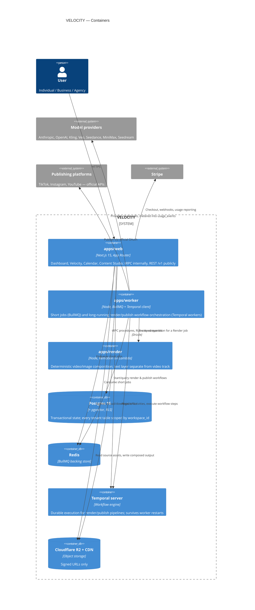

# C4 — Container Diagram

**Boundary rule (see ADR 0001):** a job goes to BullMQ if it is short, stateless, and safe to lose on a crash (notifications, quick sync). It goes to Temporal if it is multi-minute, multi-vendor, must survive a worker restart without duplicating spend, or has compensating/retry semantics tied to money (render, publish).
