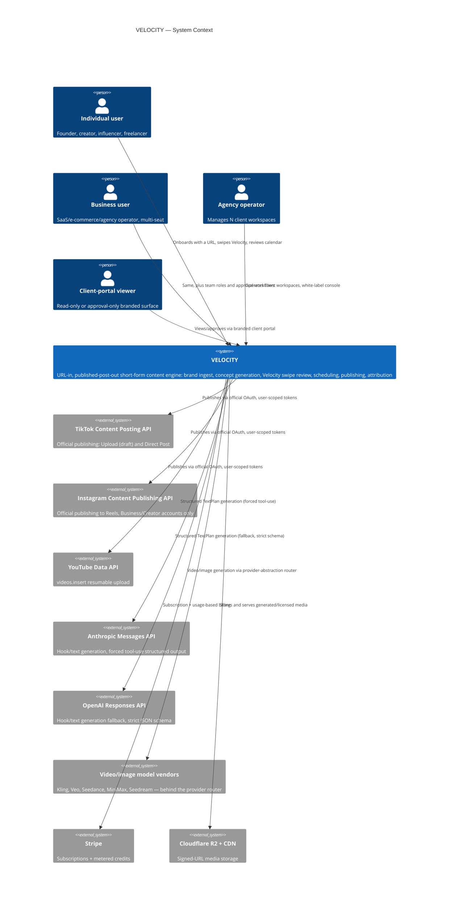

# C4 — System Context

**Note on scope:** no system in this diagram is ever asked to create, warm, or trade social accounts on VELOCITY's behalf (Appendix B). All three publishing integrations are official, user-authorised OAuth only (C1).
